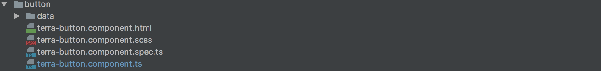
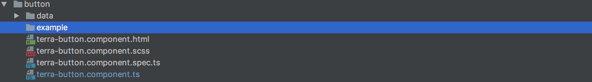
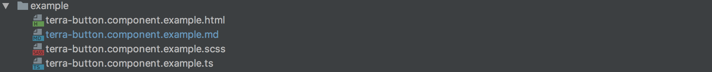
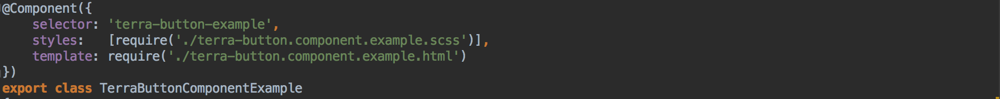
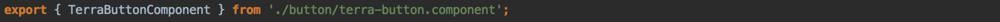
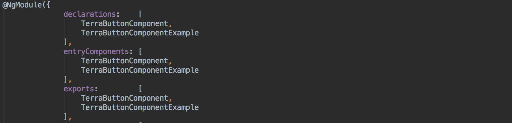
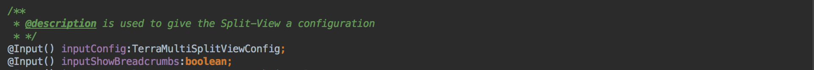
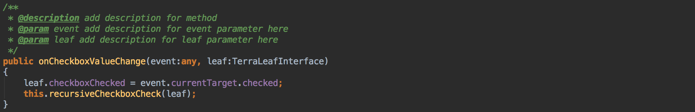
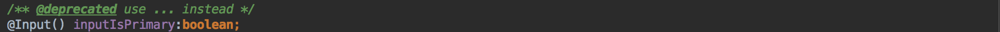
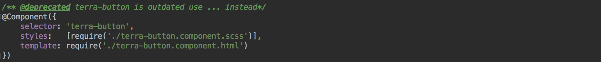

# developer guide #
* [create an example for a terra-component](#example)
* [add description to a method or property](#description)
* [add description to a method parameter](#paramdescription)
* [set component, method or property to deprecated](#deprecated)

##  how to create an example

* if you created a new component or want to add an example to an existing component  
  this guide will show you which requirements you need to fulfill so 
  that the documentation works properly.
	
* the component directory without example may looks like this.

<space>

* create an directory inside the component folder and name it `example` the name is very important. 

<space>

* now you need to create three files
  * the `html` , `scss` , `ts` file.
  * optional you can create a `markdown` file to show text at the overview.
  * the correct convention to name a file is '`selector`.component.example.extension'
  * example: 'terra-button.component.example.ts'
 
 
* after you are done the directory should look like this.   

<space>

* create a angular component.
	* the correct convention to name the component `selector` is '`selector`-example'
	* `example`: 'terra-button-example'
	* link the `html` and `scss` file to the component

<space>

* finally add the new example component to the `NgModule` at the 'terra-components.module.ts' file.
	* the component you are writing the example for has to be exported in 'terra-components.module.ts'
<space>

 

* add the component name to `declarations`, `entryComponents` and `exports`.

<space>
 

##  how to add a description

* the `@description` tag has to be directly on top of function or property that you want to add it to.

<space>

	
##  how to add a description to a method parameter

* how to use: `@param` `variable name` `description`
* the `@param` tag has to be placed directly on top of the function. 
* example: `@param` `orderId` The ID of the order 

<space>
 
	
##  how to set deprecated

* the `@deprecated` tag has to be placed directly on top of the function or property.

<space>
 

* you can also add the `@deprecated` tag to whole component to declare it deprecated.

<space>
 

